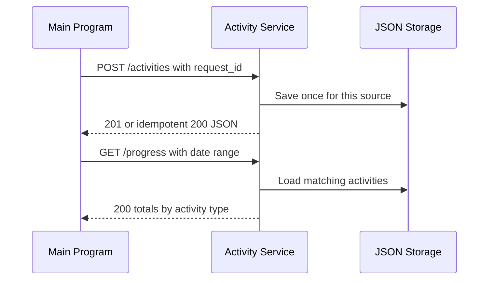

# Activity History and Progress Service

MS5 is a reusable service for recording completed activities and returning
progress summaries.

## Communication contract

The service uses a REST API with JSON at `http://127.0.0.1:5105` by default.

| Method and path | Purpose |
| --- | --- |
| `GET /health` | Check whether the service is running |
| `POST /activities` | Record one completed activity idempotently |
| `GET /activities?source={program}` | List one Main Program's recorded activities |
| `GET /progress?source={program}&start=...&end=...` | Count that program's activities by type |

Recording requires `request_id`, `name`, `activity_type`, and an ISO 8601
`completed_at` value. Sending the same `request_id` twice returns the original
record without storing a duplicate for that caller. A different Main Program
can use the same `request_id` without colliding when it sends its own `source`.

Each caller should send a stable `source` name. Browser-based callers can set
`MAIN_PROGRAM_ORIGINS` to a comma-separated list of allowed origins. The older
single-value `MAIN_PROGRAM_ORIGIN` setting still works.

### How to request data

```powershell
python -m pip install -r requirements.txt
python app.py
```

In another terminal:

```powershell
Invoke-RestMethod -Method Post -Uri http://127.0.0.1:5105/activities `
  -ContentType application/json `
  -Body '{"source":"HabitTracker","request_id":"checkin-1","name":"Morning walk","activity_type":"exercise","completed_at":"2026-08-08T18:00:00Z"}'
```

### How to receive data

New records return HTTP 201. Repeating the same `source` and `request_id`
returns HTTP 200 with `created: false` and the original record.

```json
{
  "created": true,
  "activity": {
    "id": "service-created-id",
    "source": "HabitTracker",
    "request_id": "checkin-1",
    "name": "Morning walk",
    "activity_type": "exercise",
    "completed_at": "2026-08-08T18:00:00+00:00",
    "metadata": {}
  }
}
```

`GET /progress?source=HabitTracker&start=...&end=...` returns
`total_activities`, exact `by_activity_type` counts, and the requested range.
Invalid records and ranges return a JSON `error` object.

## Request sequence



Run the automated tests with `python -m pytest -q`.

## Sprint 3 stories

- Record a completed activity.
- View an activity and progress summary for a date range.

## Remaining shared work

Recording, persistence, caller-scoped idempotency, date-range summaries,
validation, the exact 20-activity accuracy fixture, and the shared cross-program
contract are implemented. Deletion, export, streak calculations, and larger
optional load fixtures remain available for shared follow-up work.
